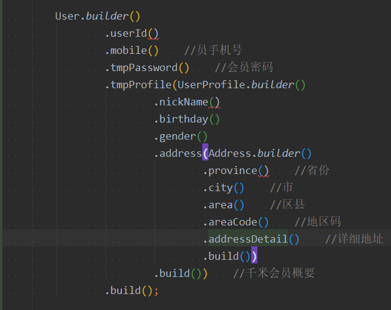

# Joker Intellij Plugin

## 安装方法

目前只支持本地安装,比较成熟后准备放到插件官网

File-->Settings-->Plugins-->菊花图案-->Install plugin from Disk...-->选择joker.zip-->重启Intellij

##功能说明

1. 根据类定义或者申明的类对象,生成该类所有的setXXX()方法如图:

   方法: 光标在类的代码上-->Code-->Generate-->Generate Builder

   

2.根据类定义或者申明的类对象,生成该类(递归所以包含的类对象)所有的setXXX()方法如图:

方法: 光标在类的代码上-->Code-->Generate-->Generate Builder-->Generate Builder Plus

3.
