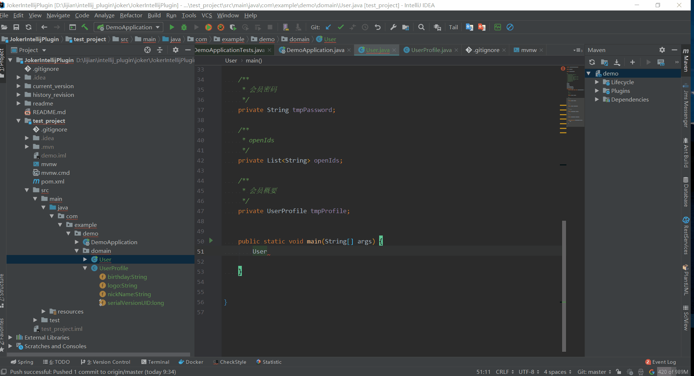

# Joker Intellij Plugin

## 安装方法

1. 在线安装:
   
   File-->Settings-->Plugins-->搜索Joker

2. 本地安装:
   
   2.1 本地安装方法一
   
   打开Intellij, 拖动文件joker.zip到代码编辑框,然后按照提示重启
   
   
   2.1 本地安装方法二 
   
   File-->Settings-->Plugins-->菊花图案-->Install plugin from Disk...-->选择joker.zip(joker.jar)-->重启Intellij

## 功能说明

1. 根据类定义,生成该类Builder方法如图(Version 0.01实现):
   
   方法: 光标在类的代码上-->Code-->Generate-->Generate Builder
   
   

2.根据类定义,生成该类Builder方法(递归所以包含的类对象)如图(Version 0.01实现):

方法: 光标在类的代码上-->Code-->Generate-->Generate Builder-->Generate Builder Plus

3.根据类定义或者申明的类对象,生成所有的setXXX()方法如图(Version 0.01实现):

光标在类的代码上(或者类对象上)-->Code-->Generate-->Generate Builder-->Generate all set

4.根据类定义生成Json如图(Version 0.02实现):

5.Dubbo测试用具(Version 0.02实现):

第一种使用方法可以自动生成测试用json参数,需要在代码中选中接口文件

第二种使用方法需要手动写测试用json参数

> 

## todo list

1. dubbo 测试导出导入功能。

2. 选择两个Bean,生产converter,相互转换。

## 修复的bug (当前最高版本0.3)

1. 0.6 修改的bug:(2021-9-9)
   
   - 修改操作界面
   - 解决中文乱码问题
   - 解决UI线程阻塞问题

## 欢迎提各种问题

lijian79@gmail.com
791565455@qq.com
