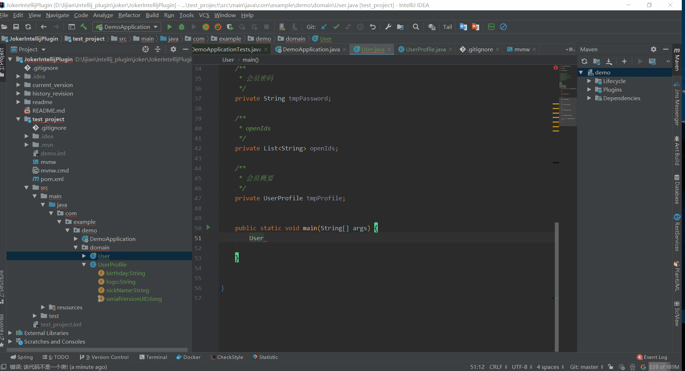

# Joker Intellij Plugin

## 安装方法

在线安装:
File-->Settings-->Plugins-->搜索Joker
本地安装:
File-->Settings-->Plugins-->菊花图案-->Install plugin from Disk...-->选择joker.zip-->重启Intellij

## 功能说明

1. 根据类定义,生成该类Builder方法如图:

   方法: 光标在类的代码上-->Code-->Generate-->Generate Builder

   

2.根据类定义,生成该类Builder方法(递归所以包含的类对象)如图:

方法: 光标在类的代码上-->Code-->Generate-->Generate Builder-->Generate Builder Plus

3.根据类定义或者申明的类对象,生成所有的setXXX()方法如图:

光标在类的代码上(或者类对象上)-->Code-->Generate-->Generate Builder-->Generate all set

## todo list

- [ ] 对于功能1-3, 目前只支持多行注释的复制,对于单号注释还不支持。Jpa如果没有注释，在定义表字段上的注释，复制过来。

- [ ] 实现dubbo测试工具：测试本地或者远程启动的dubbo提供者，根据provider中的方法及入参。

- [ ] 模板代码生成如图

      

- [ ] 还有Jpa和Mybatis代码生成。。。

## 欢迎提各种问题

lijian79@gmail.com

